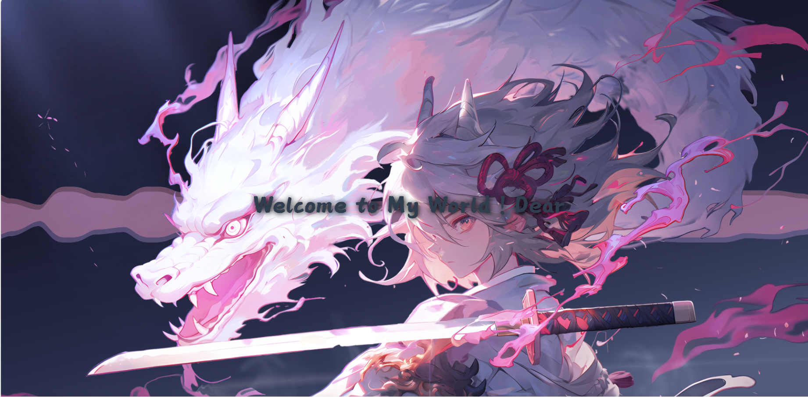
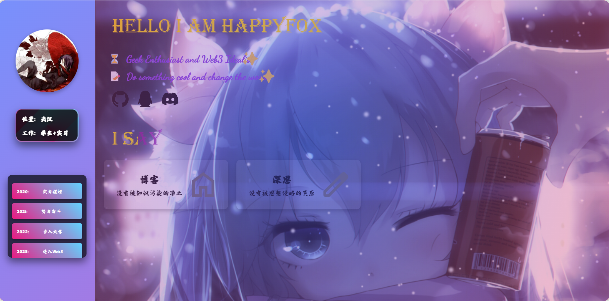

# Happyfox的个人主页

### 滑动式单页面

[展示站点](https://happyfox001.github.io/personal-blog/)





## 功能

Vue搭建的单页面个人主页，代码逻辑清晰（不喜勿喷），适用于进一步开发强大的博客和融合各类插件。

Vue-cli设计，通过下列方法设置即可。

未来打算用node做一个后端，估计是暑假的事情了。。。

```
npm install
```

```
npm run serve
```

## 引用

图一取自Wallpaper 熠烛的《御剑驭龙-红鸾樱落》

图二取自Wallpaper Agni_Shine的《Miku-可自定义-雪花散落的冬季v1.31》